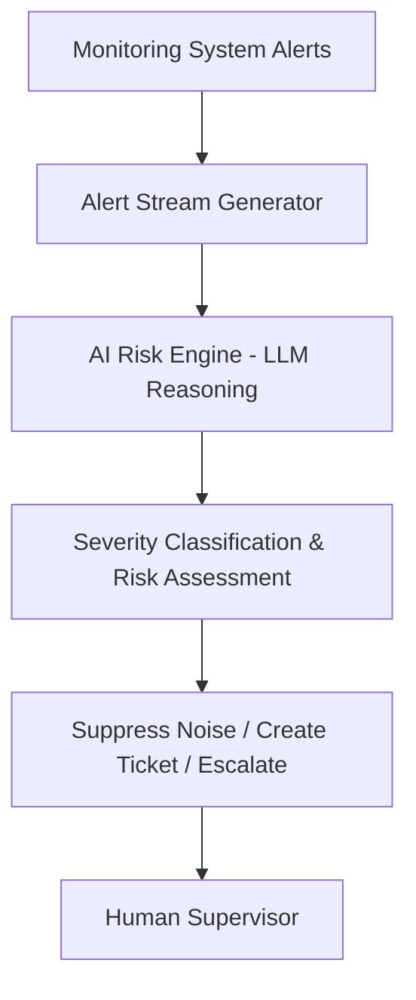

# AI-Native Operational Risk Engine

An AI-native system that automates operational alert triage by evaluating incoming alerts, suppressing noise, assigning severity, and escalating high-risk incidents to human supervisors.

This project was developed as part of the **Wealthsimple AI Builder Challenge**, which explores how modern AI can redesign legacy operational workflows rather than simply automating them.

---

## Demo Video

Watch the 2–3 minute system demo:

https://drive.google.com/file/d/1ieV7PM-XVuF6kRFWs1a6O6FRQu7jG4Vt/view?usp=sharing

---

## Problem

Operational monitoring systems generate large volumes of alerts. In many organizations, teams manually triage these alerts by:

- reviewing incoming alerts
- determining whether the alert is actionable
- assigning severity levels
- creating incident tickets
- routing incidents to the correct teams

This process is repetitive, time-consuming, and contributes to alert fatigue.

---

## AI-Native Approach

This project redesigns the alert triage workflow using an AI system that takes on **first-line operational judgment**.

Instead of humans reviewing every alert, the AI evaluates alert context and decides how it should be handled.

The system analyzes:

- system type
- environment (production, development, testing)
- failure rate
- latency
- potential regulatory exposure

Based on this evaluation, the AI can:

- suppress known benign alerts
- classify severity (P1–P4)
- flag regulatory risk
- generate structured incident tickets
- escalate high-risk incidents to human supervisors

This allows humans to move from **manual triage** to **supervisory oversight**.

---

## Key Features

- AI-based alert severity classification  
- Noise suppression for known benign events  
- Regulatory risk detection  
- Correlated alert detection  
- Confidence-based human escalation  
- Operational metrics dashboard  

---

## Architecture

---

## Human-AI Responsibility Boundary

The AI system handles **routine operational triage**, but critical decisions remain human.

Human oversight is required for:

- P1 incidents
- regulatory-risk alerts
- low-confidence classifications
- customer-impact decisions

This ensures AI assists operations without removing human accountability.

---

## Tech Stack

- Python  
- Streamlit  
- Ollama (Llama3)  
- Local LLM inference  
- Rule-based governance layer  

---

## Running the Project

Install dependencies: pip install -r requirements.txt

Start the local model: ollama run llama3

Launch the application: streamlit run app.py

---

## Future Improvements

Potential extensions for production environments:

- integration with monitoring platforms
- automated Jira / incident management integration
- model drift detection
- large-scale alert correlation
- improved anomaly detection

---

## Why This Project

This project explores how AI can transform operational workflows by shifting humans from **manual execution** to **supervisory decision-making**.

Rather than automating legacy processes, the goal is to rethink how operational risk management should work in an **AI-native environment**.
